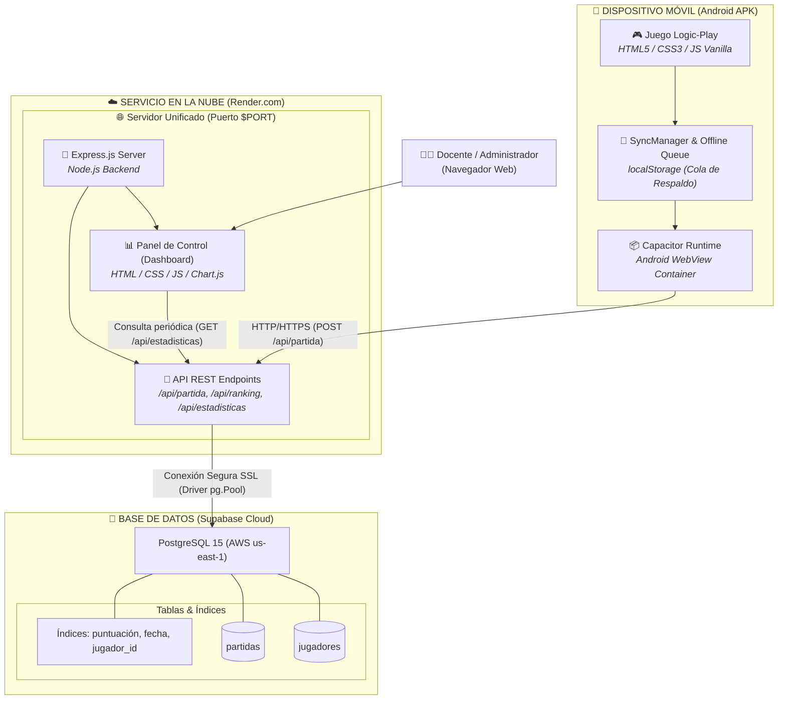
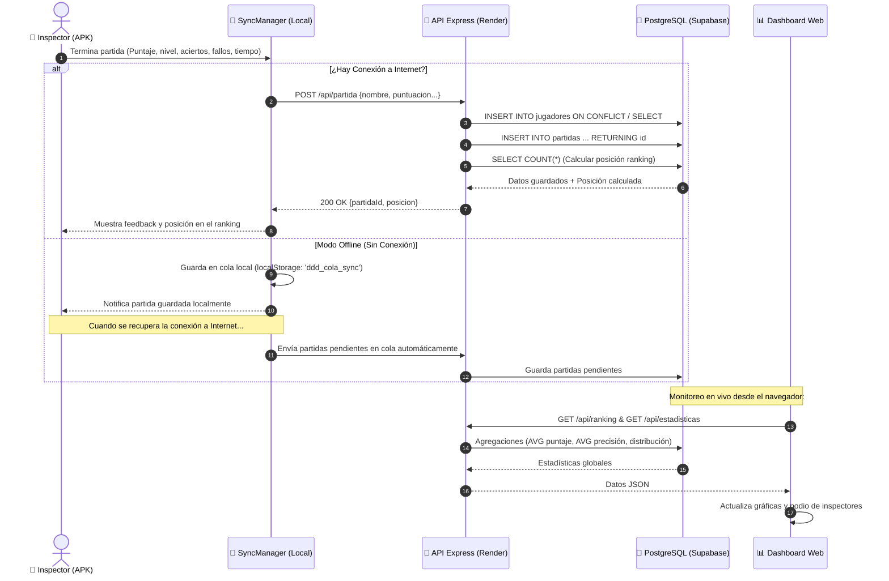

# Arquitectura del Sistema y Flujo de Datos — Logic-Play UPTT

Este documento describe la arquitectura global, las tecnologías utilizadas y el flujo de datos del ecosistema **Logic-Play UPTT (D.D.D. - Inspector Lógico)**.

---

## 1. Diagrama de Arquitectura Global del Sistema

El siguiente diagrama ilustra la interacción entre el cliente móvil (APK), el servicio en la nube unificado (Render) y la base de datos relacional (Supabase):



---

## 2. Diagrama de Secuencia: Ciclo de Vida de Partida y Sincronización Offline

El juego implementa una arquitectura **Offline-First**. Si el jugador no cuenta con acceso a internet durante su sesión, la información no se pierde: se encola localmente y se sincroniza automáticamente en segundo plano cuando se restablece la conexión.



---

## 3. Matriz Tecnológica por Capa

| Capa / Componente | Tecnología | Rol y Propósito |
| :--- | :--- | :--- |
| **Núcleo del Juego** | **HTML5 Semántico + CSS3 Puro** | Interfaz visual estilo terminal retro (*Papers, Please*), diseño responsivo adaptable a móviles y efectos visuales sin frameworks pesados. |
| **Lógica del Juego** | **JavaScript Vanilla (ES6+)** | Motor de reglas lógicas, generación procedural de casos, cálculo de tablas de verdad, inferencias y sintetizador de audio web. |
| **Empaquetador Móvil** | **Capacitor 8 + Android SDK** | Transforma la web del juego en una aplicación nativa de Android (`.apk`), habilitando su instalación y ejecución local. |
| **Persistencia Local** | **Web Storage (localStorage)** | Soporte **100% offline**: almacena la identidad del inspector (UUID) y la cola de partidas pendientes de sincronización. |
| **Servidor Backend** | **Node.js + Express.js** | Arquitectura de servidor unificada que expone la API REST y sirve el Dashboard administrativo en un **único puerto**. |
| **Base de Datos** | **PostgreSQL (Supabase Cloud)** | Base de datos relacional en la nube (AWS), con soporte de integridad referencial, claves foráneas en cascada e índices optimizados. |
| **Driver de Conexión** | **`pg` (node-postgres Pool)** | Manejo eficiente de conexiones concurrentes (`Pool`) con encriptación SSL forzada para servicios cloud. |
| **Panel Administrativo** | **Chart.js + Glassmorphism CSS** | Dashboard web para docentes con gráficas de precisión, distribución de niveles, métricas globales y reloj en tiempo real. |
| **Hosting & Despliegue** | **Render.com** | Plataforma de alojamiento en la nube con despliegue continuo integrado a GitHub. |

---

## 4. Esquema de Base de Datos (PostgreSQL en Supabase)

### Tabla `jugadores`
Almacena la identidad única de los inspectores:
- `id`: `SERIAL PRIMARY KEY`
- `nombre`: `VARCHAR(50) NOT NULL UNIQUE`
- `created_at`: `TIMESTAMP WITH TIME ZONE DEFAULT CURRENT_TIMESTAMP`

### Tabla `partidas`
Almacena el historial y métricas de cada partida completada:
- `id`: `SERIAL PRIMARY KEY`
- `jugador_id`: `INTEGER NOT NULL REFERENCES jugadores(id) ON DELETE CASCADE`
- `puntuacion`: `INTEGER NOT NULL DEFAULT 0`
- `nivel_alcanzado`: `INTEGER NOT NULL DEFAULT 1`
- `aciertos`: `INTEGER NOT NULL DEFAULT 0`
- `fallos`: `INTEGER NOT NULL DEFAULT 0`
- `tiempo_jugado`: `INTEGER NOT NULL DEFAULT 0` (duración en segundos)
- `inspecciones_doc`: `INTEGER NOT NULL DEFAULT 0` (veces que consultó el manual)
- `jugado_en`: `TIMESTAMP WITH TIME ZONE DEFAULT CURRENT_TIMESTAMP`

### Índices de Rendimiento
- `idx_jugadores_nombre`: Búsqueda instantánea de jugadores por nombre.
- `idx_partidas_jugador_id`: Optimización de consultas de historial por inspector.
- `idx_partidas_puntuacion`: Aceleración de ordenamiento para el ranking global (`DESC`).
- `idx_partidas_jugado_en`: Búsqueda y agregaciones temporales.

---

## 5. Endpoints de la API REST

Todos los endpoints están alojados bajo la ruta `/api`:

| Método | Endpoint | Descripción | Parámetros / Body |
| :--- | :--- | :--- | :--- |
| `POST` | `/api/partida` | Registra una nueva partida y retorna la posición en el ranking | `{ nombre, puntuacion, nivel_alcanzado, aciertos, fallos, tiempo_jugado, inspecciones_doc }` |
| `GET` | `/api/ranking` | Retorna los 20 mejores jugadores ordenados por puntaje máximo | Ninguno |
| `GET` | `/api/ranking/:nombre` | Retorna los datos y últimas 20 partidas de un jugador | `nombre` en la URL |
| `GET` | `/api/estadisticas` | Retorna totales globales y distribución por nivel | Ninguno |
| `GET` | `/api/health` | Verifica estado del servidor y la conexión a PostgreSQL | Retorna `{ ok: true, database: 'connected' }` |

---

## 6. Despliegue y Ejecución

### Ejecución Local
```bash
# Iniciar servidor unificado (Dashboard en http://localhost:3000)
npm start

# O modo desarrollo con recarga concurrente:
npm run dev
```

### Inicialización de Tablas en Supabase
```bash
cd api
npm run db:init
```

### Generación del APK de Android
```bash
# 1. Sincronizar cambios web con Android
npx cap sync

# 2. Compilar APK debug
npm run build:apk
```
*El instalador generado se encuentra en `app-debug.apk` en la raíz del proyecto.*
